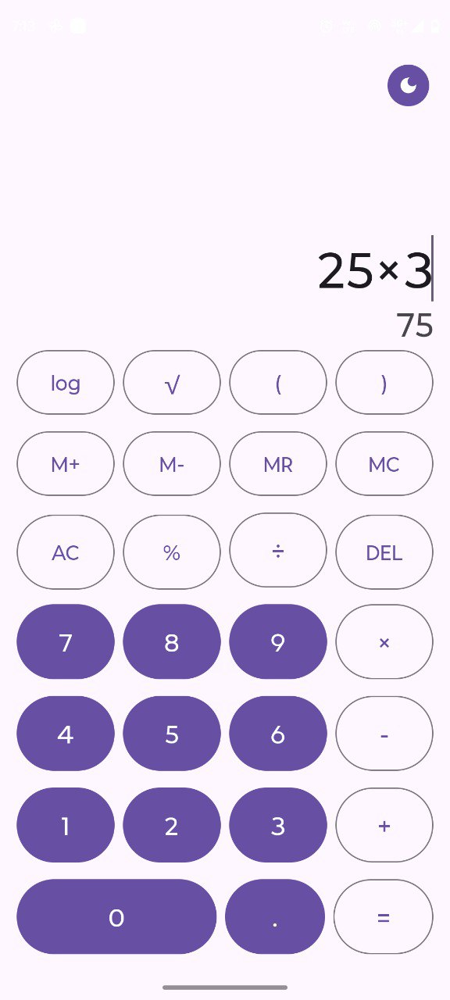
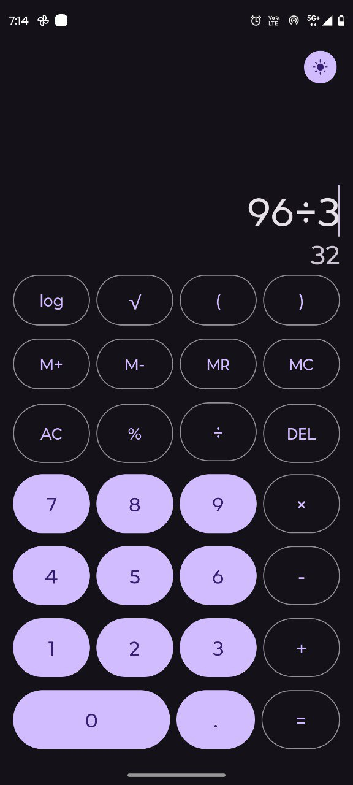
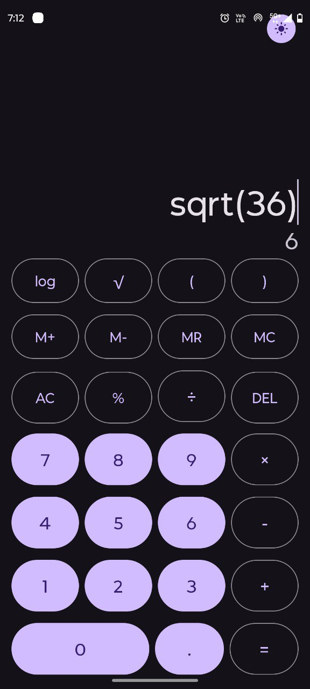
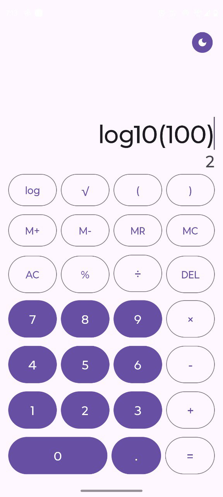

# ShadowFoxCalculator 🧮


**A powerful, scientific Android calculator application built with Kotlin and Material Design 3.** This app goes beyond basic arithmetic by featuring a real-time expression evaluator, scientific functions, memory operations, and a seamless dark/light mode toggle. It leverages the robust **exp4j** library for precise mathematical parsing.

---

## 📱 Features

### Core Functionality
* **Arithmetic Operations:** Supports addition, subtraction, multiplication, and division with standard precedence (BODMAS).
* **Real-Time Evaluation:** Displays the result instantly as you type, improving calculation speed.
* **Smart Input Handling:** Prevents invalid syntax (e.g., multiple decimals or operators) with intelligent cursor logic.
* **History & Editing:** Includes a responsive cursor for editing expressions and a backspace function for precise corrections.

### Advanced Features (Bonus)
* **Scientific Functions:** Includes Square Root (`√`), Logarithm (`log`), and Parentheses `()` for complex equations.
* **Memory Operations:** Full suite of memory keys: `M+` (Add), `M-` (Subtract), `MR` (Recall), and `MC` (Clear).
* **Smart Percentages:** Intuitively handles percentages (e.g., `150 + 10%` calculates as `165`).
* **Theme Toggle:** One-tap switch between Light and Dark modes, with user preference saved automatically.
* **Robust Error Handling:** Gracefully manages division by zero and syntax errors without crashing.

---

## 🛠️ Tech Stack

* **Language:** Kotlin
* **IDE:** Android Studio Otter
* **UI Toolkit:** XML / View System
* **Design System:** Material Design 3 (M3)
* **Math Engine:** [exp4j](https://www.objecthunter.net/exp4j/) (Expression Builder)
* **Storage:** SharedPreferences (for theme persistence)

---

## 📸 Screenshots

| Light Mode | Dark Mode | Scientific Ops | Complex Log |
|:---:|:---:|:---:|:---:|
|  |  |  |  |

---

## 🚀 How to Run

1.  **Clone the repository:**
    ```bash
    git clone [https://github.com/ghodkevrushabh/shadowfox-calculator-app.git](https://github.com/ghodkevrushabh/shadowfox-calculator-app.git)
    ```
2.  **Open Android Studio.**
3.  **Select File > Open** and navigate to the cloned directory.
4.  **Sync Gradle:** Let Gradle finish syncing (this downloads the `exp4j` library).
5.  **Run:** Press the Run button (▶) to launch on an emulator or physical device.

---

## 📝 Key Code Highlights

### Math Evaluation Logic (using exp4j)
This function sanitizes inputs, handles custom percentage logic, and evaluates the string.

```
private fun evaluateExpression(expressionString: String): String {
    try {
        // 1. Sanitize input for the parser
        var evalString = expressionString.replace("×", "*").replace("÷", "/")
        
        // 2. Handle smart percentages (e.g., 100 + 10%)
        val regex = Regex("([\\d.]+)\\s*([+\\-])\\s*([\\d.]+)%")
        evalString = regex.replace(evalString) {
            val num1 = it.groupValues[1].toDouble()
            val operator = it.groupValues[2]
            val percentVal = it.groupValues[3].toDouble()
            "($num1 $operator ($num1 * $percentVal * 0.01))"
        }

        // 3. Build and evaluate
        val expression = ExpressionBuilder(evalString).build()
        val result = expression.evaluate()
        return numberFormatter.format(result)
    } catch (e: Exception) {
        return "Error"
    }
}
```
___

## Theme Toggle Persistence :

We use SharedPreferences to remember the user's choice even after the app closes.

```
binding.themeToggleButton.setOnClickListener {
    isDarkMode = !isDarkMode
    // Save preference
    sharedPref.edit().putBoolean(THEME_KEY, isDarkMode).apply()
    // Apply theme
    if (isDarkMode) {
        AppCompatDelegate.setDefaultNightMode(AppCompatDelegate.MODE_NIGHT_YES)
    } else {
        AppCompatDelegate.setDefaultNightMode(AppCompatDelegate.MODE_NIGHT_NO)
    }
}
```
